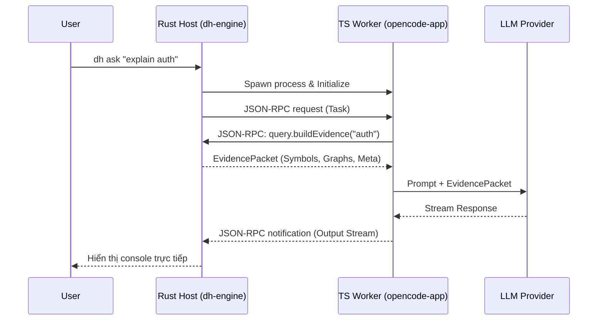

# Kế hoạch triển khai Phase 4: Vertical Slice (Quick Task Mode)

**Date:** 2026-04-27
**Lane:** `migration` -> `delivery` (cho tính năng mới của TS layer)
**Mục tiêu:** Xây dựng đường ống (pipeline) End-to-end đầu tiên nối Rust Engine với LLM thông qua TS Worker, chạy thành công `Quick Task Mode`.

---

## 1. Mục tiêu (Objective)
Chứng minh rằng tầng TypeScript có thể giao tiếp mượt mà với Rust Engine qua giao thức JSON-RPC, lấy được Evidence (ngữ cảnh cấu trúc mã) và chuyển tiếp thành công cho LLM để sinh ra câu trả lời hoặc code chất lượng cao, trước khi mở rộng ra Multi-agent State Machine phức tạp.

## 2. Kiến trúc luồng (Vertical Workflow Architecture)

---

## 3. Phân rã Task (Task Breakdown)

### Phase 4.1: TS Bridge & Handshake Foundation
- [ ] Khởi tạo thư viện RPC Core trong `packages/shared/` hoặc `packages/runtime/`.
- [ ] Triển khai `Content-Length` framing reader/writer cho luồng Stdio (stdin/stdout).
- [ ] Xây dựng bộ Type (Zod) đồng bộ với Rust struct (đặc biệt là `EvidencePacket`, `InitializeResult`).
- [ ] Hoàn thiện quá trình Handshake (`initialize` -> `initialized` -> `ready`).

### Phase 4.2: Evidence Consumer (TS Layer)
- [ ] Implement RPC method wrapper: `query.buildEvidence(query: string)`.
- [ ] Viết hàm parse và format `EvidencePacket` thành context an toàn để nhúng vào Prompt.

### Phase 4.3: LLM Integration & Quick Agent
- [ ] Khởi tạo module quản lý LLM provider (bắt đầu bằng OpenAI hoặc Anthropic) trong `packages/providers/`.
- [ ] Viết Prompt Template chuẩn cho `Quick Agent`, bắt buộc dựa trên Evidence (không bịa code).
- [ ] Tích hợp cơ chế Streaming response từ LLM.

### Phase 4.4: Handoff & Terminal Output
- [ ] Đẩy stream dữ liệu trả về Rust thông qua JSON-RPC notification (`event.tool.outputChunk`).
- [ ] Thử nghiệm end-to-end command: `dh ask "where is the router defined?"`.

---

## 4. Phân công Agent (Agent Assignments)

| Thành phần | Agent phụ trách | Nhiệm vụ chính |
|---|---|---|
| **JSON-RPC Bridge (TS)** | `backend-specialist` | Đảm bảo luồng stdio không bị corrupt, đúng chuẩn LSP framing. |
| **LLM & Provider** | `backend-specialist` | Tích hợp SDK, xử lý streaming, tính toán token. |
| **Prompt Engineering** | `orchestrator` / `project-planner` | Thiết kế prompt cho Quick Agent sao cho bám sát EvidencePacket. |
| **E2E Testing** | `qa` | Xác minh Rust Host khởi chạy được TS Worker và hiển thị được output. |

---

## 5. Tiêu chí nghiệm thu (Verification Checklist)
- [ ] **Bridge Quality:** Không có lỗi JSON parse error hoặc stream deadlock giữa Rust và TS.
- [ ] **Data Integrity:** TS nhận được đầy đủ `EvidencePacket` (có source code chunk, symbol, import graph edges) y hệt như những gì Rust sinh ra.
- [ ] **Output:** Khi user chạy `dh ask`, console hiện ra câu trả lời stream mượt mà, và câu trả lời CÓ SỬ DỤNG thông tin từ mã nguồn nội bộ.
- [ ] **Crash Recovery:** Nếu giết (kill) process TS bằng tay, Rust phát hiện được và khởi động lại.

---

## 6. Socratic Gate (Các câu hỏi mở cần quyết định trước khi code)

> [!WARNING]
> Vui lòng xác nhận các thông tin sau để chốt implementation chi tiết:

1. **LLM Provider đầu tiên:** Chúng ta sẽ dùng provider nào (OpenAI, Anthropic) và thông qua thư viện nào (ví dụ `@ai-sdk` hay gọi fetch chay) làm mặc định cho MVP này?
2. **TypeScript Runtime:** Rust sẽ gọi `node build/index.js`, `tsx src/index.ts` hay dùng `bun`/`deno` cho TS Worker trong quá trình development này?
3. **Zod Validation:** Chúng ta có nên bắt buộc dùng Zod để parse mọi JSON-RPC message từ Rust để đảm bảo an toàn tuyệt đối ngay từ đầu không?
