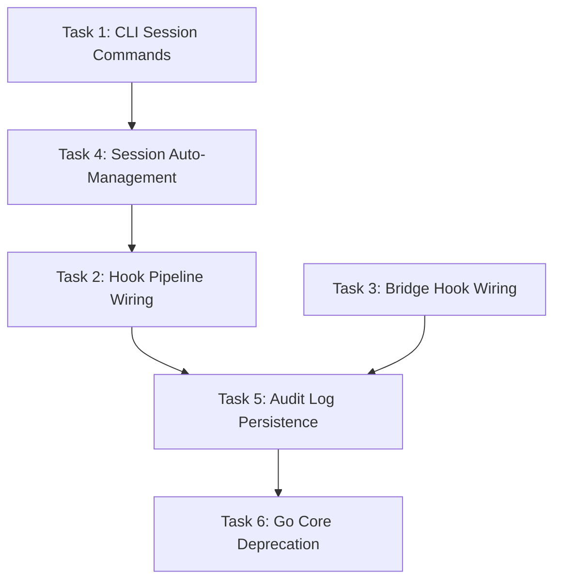

# PLAN: Rust Runtime Direct Cutover — Wiring & Go Core Deprecation

## Context

Rust runtime core đã hoàn thành 6 phases (Types → Storage → Supervisor → Hooks → Session Manager → Binary Packaging). Tất cả modules đã pass test (69 unit + 3 integration). Bước cuối cùng là **nối dây (wiring)** các module này vào luồng thực thi thật của `dh-engine`, biến Rust thành **single source of truth** cho session lifecycle, hook enforcement, và audit logging.

**Option A — Direct Cutover** được chọn: loại bỏ Go Core ngay, wire trực tiếp hooks + session_manager vào request pipeline.

---

## Current State (đã hoàn thành)

| Module | File | Status |
|--------|------|--------|
| Types | `dh-types/src/lib.rs` | ✅ 6 type families |
| Storage | `dh-storage/src/lib.rs` | ✅ 4 tables + repositories |
| Supervisor | `worker_supervisor.rs` | ✅ 3-monitor pattern |
| Hooks | `hooks.rs` | ✅ 6 hooks + dispatcher |
| Session Manager | `session_manager.rs` | ✅ Full lifecycle |
| Binary | `Cargo.toml` | ✅ 9.2MB arm64 |

## What's Missing (Wiring Gaps)

| Gap | Description |
|-----|-------------|
| **CLI Session Commands** | `main.rs` không có `session create/resume/status` commands |
| **Hook Injection into Pipeline** | `host_commands.rs::send_session_run_command()` không chạy hooks |
| **Session Lifecycle in Knowledge Commands** | `Ask/Explain/Trace` không tạo/resume session |
| **Bridge Hook Interception** | `bridge.rs::run_bridge_server()` loop không qua hooks |
| **Audit Log Persistence** | Hook invocation logs không được ghi vào DB |
| **Go Core Deprecation** | Chưa có markers/warnings cho Go core removal |

---

## Proposed Changes

### Task 1: CLI Session Subcommands (`main.rs`)

#### [MODIFY] [main.rs](file:///Users/duypham/Code/DH/rust-engine/crates/dh-engine/src/main.rs)

Thêm `Session` subcommand group vào `Commands` enum:

```rust
Session {
    #[command(subcommand)]
    action: SessionAction,
}

#[derive(Debug, Subcommand)]
enum SessionAction {
    Create {
        #[arg(long, value_enum)]
        lane: LaneArg,  // quick | delivery | migration
        #[arg(long, default_value = ".")]
        workspace: PathBuf,
    },
    Resume {
        #[arg(long)]
        id: String,
        #[arg(long, default_value = ".")]
        workspace: PathBuf,
    },
    Status {
        #[arg(long)]
        id: String,
        #[arg(long, default_value = ".")]
        workspace: PathBuf,
    },
    Complete {
        #[arg(long)]
        id: String,
        #[arg(long, default_value = ".")]
        workspace: PathBuf,
    },
}
```

Dispatch logic:
- `session create --lane quick` → `SessionManager::create_session()` + `activate_session()`
- `session resume --id <id>` → `SessionManager::resume_session()` → print state JSON
- `session status --id <id>` → `SessionManager::resume_session()` + `stage_history()`
- `session complete --id <id>` → `SessionManager::complete_session()`

**Output**: JSON trên stdout cho machine-readable consumption.

**Estimated LOC**: ~80

---

### Task 2: Wire HookDispatcher into Knowledge Command Pipeline (`host_commands.rs`)

#### [MODIFY] [host_commands.rs](file:///Users/duypham/Code/DH/rust-engine/crates/dh-engine/src/host_commands.rs)

Injection points trong `run_hosted_knowledge_command_with_config()` (line 83):

1. **Before supervisor launch** (line 89):
   - Tạo hoặc resume `SessionState` via `SessionManager`
   - Nếu `resume_session_id` có → resume; nếu không → tạo session mới với `WorkflowLane::Quick` (default)

2. **Before `send_session_run_command`** (line 102):
   - Dispatch `HookName::SessionStateInjection` → inject context vào request params
   - Dispatch `HookName::ModelOverride` → resolve model
   - Dispatch `HookName::SkillActivation` → filter skills
   - Dispatch `HookName::McpRouting` → filter MCPs

3. **Inside `route_worker_to_host_message`** (line 421):
   - Khi worker gửi reverse-RPC (query.xxx), dispatch `HookName::PreToolExec` trước khi route
   - Nếu hook blocks → return error response thay vì route query

4. **Before returning worker result** (line 104-113):
   - Dispatch `HookName::PreAnswer` → gate answer quality
   - Nếu blocked → wrap result với warning

5. **Persist all hook logs**:
   - Sau mỗi dispatch call, ghi `HookInvocationLog` vào DB via `HookLogRepository`

**Data flow mới**:
```
CLI ask "how auth works"
  → SessionManager::create_session(Quick)
  → SessionManager::activate_session()
  → HookDispatcher::dispatch(SessionStateInjection)
  → HookDispatcher::dispatch(ModelOverride)
  → HookDispatcher::dispatch(SkillActivation)
  → HookDispatcher::dispatch(McpRouting)
  → supervisor.launch()
  → supervisor.send_worker_request()
      ↓ worker reverse-RPC (query.buildEvidence)
      → HookDispatcher::dispatch(PreToolExec)  ← NEW
      → router.route_worker_query()
      ← response
  ← worker result
  → HookDispatcher::dispatch(PreAnswer)  ← NEW
  → SessionManager::pass_gate() + transition_stage()
  → output
```

**Estimated LOC**: ~150

---

### Task 3: Wire Hooks into Bridge Server (`bridge.rs`)

#### [MODIFY] [bridge.rs](file:///Users/duypham/Code/DH/rust-engine/crates/dh-engine/src/bridge.rs)

Trong `run_bridge_server()` (line 289), thêm hook dispatch trước `router.route()`:

1. Tạo `HookDispatcher` khi bridge server khởi tạo
2. Trước mỗi `router.route(request)`:
   - Nếu method là `session.runCommand` → dispatch `PreToolExec`
   - Nếu hook blocks → trả JSON-RPC error response thay vì route
3. Sau khi nhận response:
   - Nếu response chứa answer → dispatch `PreAnswer`
4. Ghi hook logs vào DB

**Estimated LOC**: ~60

---

### Task 4: Session Auto-Management trong Knowledge Commands (`host_commands.rs` + `main.rs`)

#### [MODIFY] [host_commands.rs](file:///Users/duypham/Code/DH/rust-engine/crates/dh-engine/src/host_commands.rs)

Thêm auto-session logic vào `run_hosted_knowledge_command_with_config()`:

```rust
// Pseudocode
let session_mgr = SessionManager::new(&db);
let session = match &request.resume_session_id {
    Some(id) => session_mgr.resume_session(id)?
        .context("session not found")?,
    None => {
        let id = format!("session-{}", chrono::Utc::now().timestamp_millis());
        session_mgr.create_session(&id, workspace_str, WorkflowLane::Quick)?
    }
};
session_mgr.activate_session(&session.id)?;

// Create execution envelope for this command
let envelope = session_mgr.create_envelope(
    &session.id, "dh-engine", AgentRole::Implementer, None
)?;
```

**`--lane` flag propagation**: Thêm `lane` field vào `KnowledgeCommandArgs` (line 82-97 trong `main.rs`), default `quick`.

**Estimated LOC**: ~50

---

### Task 5: Audit Log Persistence Wiring

#### [MODIFY] [host_commands.rs](file:///Users/duypham/Code/DH/rust-engine/crates/dh-engine/src/host_commands.rs)

Sau mỗi `HookDispatcher::dispatch()` call:

```rust
let (log, result) = dispatcher.dispatch(hook_name, &ctx, &input, &session.id, envelope_id);
db.insert_hook_log(&log)?;  // Persist to hook_invocation_logs table
```

Pipeline dispatch variant:
```rust
let (logs, decision) = dispatcher.dispatch_pipeline(&hooks, &ctx, &input, &session.id, envelope_id);
for log in &logs {
    db.insert_hook_log(log)?;
}
```

**Estimated LOC**: ~20

---

### Task 6: Go Core Deprecation Markers

#### [NEW] `docs/DEPRECATION-go-core.md`

Tạo deprecation notice:

```markdown
# Go Core Deprecation Notice

## Effective: Immediately (as of Rust Runtime v0.1.0)

### What's Deprecated
- `packages/opencode-core/` — Go-based hook enforcement and session bridge
- Go binary distribution for hook/session management

### Replacement
- `dh-engine` Rust binary now owns:
  - Session lifecycle (create/resume/transition/complete)
  - Hook enforcement (6 policy hooks)
  - Audit logging (SQLite-backed invocation logs)
  - Worker supervision (3-monitor pattern)

### Migration Path
- TS Worker continues to handle workflow logic, agent orchestration, LLM interaction
- TS Worker receives session context via SessionStateInjection hook
- All tool execution gated by PreToolExec hook
- All answer quality gated by PreAnswer hook

### Removal Timeline
- Phase 1 (Current): Go core hooks bypassed, Rust hooks active
- Phase 2 (Next release): Go core binary no longer distributed
- Phase 3 (Following release): Go core code removed from repository
```

**Estimated LOC**: ~30

---

## Task Dependency Graph



**Execution Order**: T1 → T4 → T2 → T3 → T5 → T6

---

## Verification Plan

### Per-Task Verification

| Task | Verification |
|------|-------------|
| T1 | `dh-engine session create --lane quick --workspace /tmp/test` → JSON output với session_id |
| T2 | `dh-engine ask "how auth works"` → hook_invocation_logs populated in SQLite |
| T3 | Bridge server accepts request → PreToolExec blocks `grep` → error response |
| T4 | `dh-engine ask "explain"` → auto-creates session, visible in `session status` |
| T5 | Query `SELECT * FROM hook_invocation_logs` → entries for every hook dispatch |
| T6 | `DEPRECATION-go-core.md` exists with timeline |

### Automated Tests

```bash
# All existing tests still pass
cargo test -p dh-engine

# New tests
cargo test -p dh-engine session_manager    # Session lifecycle
cargo test -p dh-engine hooks              # Hook dispatch
cargo test -p dh-engine host_commands      # Integration with hooks
```

### Acceptance Criteria

- [ ] `dh-engine session create --lane quick` creates persistent session
- [ ] `dh-engine ask "explain auth"` runs hooks + writes audit logs
- [ ] PreToolExec blocks OS commands (`grep`, `find`, `cat`) in `VeryHard` enforcement
- [ ] PreAnswer blocks answers with evidence_score < 0.3 in `Always` semantic mode
- [ ] Session state survives process restart (SQLite persistence)
- [ ] Hook latency overhead < 1ms per hook dispatch
- [ ] `cargo test` 69+ tests pass (no regressions)
- [ ] Release binary builds cleanly with LTO

---

## Estimated Total Effort

| Task | LOC | Complexity |
|------|-----|------------|
| T1: CLI Session Commands | ~80 | Low |
| T2: Hook Pipeline Wiring | ~150 | Medium |
| T3: Bridge Hook Wiring | ~60 | Low |
| T4: Session Auto-Management | ~50 | Low |
| T5: Audit Log Persistence | ~20 | Low |
| T6: Go Core Deprecation | ~30 | Low |
| **Total** | **~390** | **Medium** |
