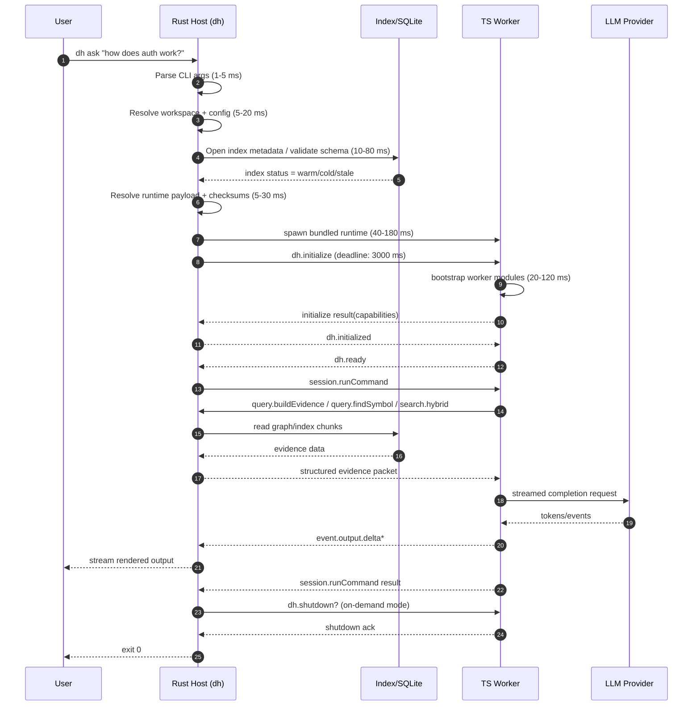
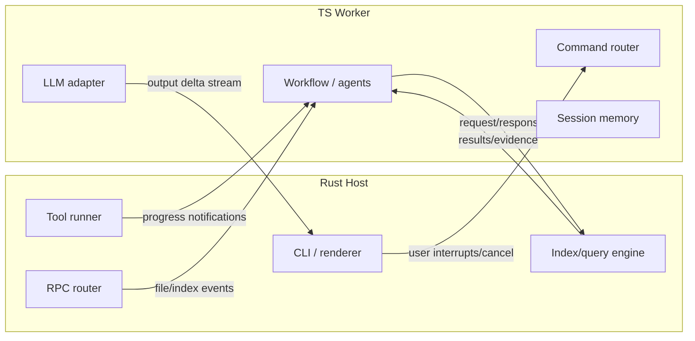

# Deep Dive 04 — Process Model for DH (Rust Host + TS Worker)

**Date:** 2026-04-13  
**Author:** System Architect  
**Status:** Proposed implementation guide  
**Scope:** Process architecture, lifecycle, packaging, bridge runtime, and operational behavior for DH  
**Depends on:** `docs/migration/2026-04-13-system-architecture-analysis-rust-ts.md`

---

## TL;DR / Executive Recommendation

**Recommended path:**

1. **Rust is the host process** and the only user-facing binary entry point: `dh`.
2. **TypeScript remains a separate child worker process** speaking **JSON-RPC over stdio** with **LSP-style framing** (`Content-Length`), not newline JSON.
3. **Ship a bundled Node runtime with the product** so users do **not** install Node.js separately. Phase 1 should use **side-by-side distribution** (`dh` + `node` + worker bundle). Phase 2 may optimize into self-extracting single-binary packaging without changing the runtime contract.

This gives DH the best balance of:

- native startup + native indexing control in Rust
- fast product iteration in TypeScript
- crash isolation between host and worker
- no user dependency on system Node
- future path to daemon mode and warm workers

---

## 0. Design Goals / Non-goals

### Goals

- `dh` must behave like a **native CLI**.
- TS workflow layer must be **replaceable, restartable, and observable**.
- No external TCP port; bridge must stay **local-only** via stdio.
- Installation must be **single product install**, not “install Rust binary + install Node + npm install”.
- The process model must support both:
  - **on-demand commands**: `dh ask`, `dh quick`, `dh doctor`
  - **future interactive/warm mode**: `dh shell` / TUI / daemon-backed sessions

### Non-goals for Phase 1

- Not building a fully embedded JS engine inside Rust.
- Not exposing Rust services over HTTP/gRPC.
- Not requiring system-wide daemon for every command.
- Not solving strong OS-level sandboxing in v1; Phase 1 emphasizes **policy + boundary enforcement** over container-grade isolation.

---

## 1. Process Architecture

### 1.1 Core process roles

### Rust = HOST / control plane / native system owner

Rust owns:

- binary entry point
- CLI argument parsing
- workspace discovery
- runtime bootstrap
- index/storage open and validation
- worker spawn / kill / restart
- stdio bridge transport
- code-intelligence engine
- system diagnostics and crash reporting
- final exit code semantics

### TypeScript = WORKER / workflow brain / orchestration plane

TS owns:

- intent interpretation for commands like `ask`, `quick`, `delivery`, `migration`
- workflow state machine
- agent orchestration
- prompt/context assembly
- LLM provider interaction
- tool policy and response shaping
- session memory above the structural intelligence layer

### 1.2 Why this model

## Why Rust should be the host

**Reason 1 — Native control of lifecycle**  
Rust can own process spawning, signals, timeouts, watchdogs, file watchers, SQLite coordination, and resource caps cleanly.

**Reason 2 — Code intelligence is the product core**  
DH's differentiated value is not “chat in terminal”; it is **deep codebase understanding**. The process that owns index/cache/query lifecycles should be the native engine itself.

**Reason 3 — Packaging is cleaner**  
If TS were the host, we would still need a native sidecar for indexing/query hot paths, but the user-visible entry point would depend on JS runtime bootstrap first. That is the wrong gravity center.

**Reason 4 — Operational clarity**  
`dh` can expose clear status like “worker failed”, “index not ready”, “worker protocol mismatch”, “bundle checksum invalid” from one authoritative host.

## Why NOT TS as host

If TS is the host:

- CLI startup depends on JS runtime first
- system packaging becomes JS-runtime-centric
- Rust becomes a plugin/subprocess despite owning the hot path
- crash semantics become inverted: the less stable/high-level layer supervises the low-level engine
- offline diagnostics (`dh doctor`, DB integrity, runtime extraction) become harder to make deterministic

Short version: **TS host makes the product feel like a JS app with a Rust accelerator**. DH should feel like a **native code-intelligence tool with a TS workflow brain**.

## Why NOT embed a JS engine into Rust (QuickJS/V8/boa/etc.)

Attractive on paper, expensive in reality.

Problems:

1. **Node ecosystem compatibility breaks**
   - OpenCode/OpenKit-style worker code assumes Node-compatible modules, streams, filesystem semantics, child process model, package ecosystem.
2. **Operational debugging gets worse**
   - separate process crash is obvious; embedded VM failures become mixed-runtime failures.
3. **Upgrades become harder**
   - upgrading TS runtime becomes coupled to binary rebuild + embedded engine behavior.
4. **Memory isolation is weaker**
   - worker leak and host leak live in one address space.
5. **Security is not automatically better**
   - embedded JS still has access to what the host exposes; attack surface simply moves inward.

Conclusion: **separate child process is the right boundary**.

### 1.3 Process tree

```text
User shell
  └─ dh ask "how auth works?"         # Rust host binary
       ├─ opens index/cache/db handles
       ├─ spawns bundled JS runtime
       │    └─ node worker/worker.mjs  # TS worker process
       └─ optionally spawns tool subprocesses under policy
            ├─ git ...
            ├─ rg ...
            └─ language/tool adapters
```

### 1.4 Process boundary diagram

```text
┌──────────────────────────────────────────────────────────────┐
│                         Rust Host (dh)                       │
│--------------------------------------------------------------│
│ CLI parser │ runtime bootstrap │ index/cache │ RPC server    │
│ worker mgr │ diagnostics       │ event bus   │ stream mux    │
└──────────────────────────────┬───────────────────────────────┘
                               │ JSON-RPC over stdio
                               │ Content-Length framed
┌──────────────────────────────▼───────────────────────────────┐
│                    TS Worker (workflow brain)                │
│--------------------------------------------------------------│
│ command router │ agent graph │ prompt builder │ LLM adapter  │
│ policy engine  │ workflow SM │ session memory │ output fmt   │
└──────────────────────────────────────────────────────────────┘
```

---

## 2. Startup Sequence — Step by Step

We design startup as a **strict staged handshake**, not “spawn process and hope”.

### 2.1 User-visible command entry

Examples:

```bash
dh ask "how does auth work?"
dh quick "rename getCwd to getCurrentWorkingDirectory"
dh doctor
```

### 2.2 Host startup phases

## Phase A — CLI parse + workspace resolution

Rust host does:

1. parse argv/subcommand/options
2. resolve workspace root
3. load config layers
   - built-in defaults
   - user config
   - workspace config
   - env overrides
4. derive runtime paths
   - cache dir
   - state dir
   - logs dir
   - worker runtime dir

**Expected budget:** `1–10 ms` warm, `5–20 ms` cold.

## Phase B — Runtime health preflight

Before worker spawn, Rust validates local prerequisites:

- config schema valid?
- runtime payload exists and checksum matches?
- SQLite/index files readable?
- index schema version compatible?
- workspace path accessible?
- lock files sane / no corrupt state?

Important: **do not fully fail command on non-fatal issues**. Convert to degraded modes where possible.

Examples:

- missing index → allow worker to run, but report `INDEX_COLD`
- checksum mismatch in worker bundle → hard fail
- stale lock file → warn and recover

## Phase C — Worker spawn strategy

Rust resolves the JS runtime payload.

**Phase-1 recommendation:**

- packaged runtime directory contains:
  - bundled `node` executable
  - transpiled worker bundle (`worker.mjs`)
  - manifest (`manifest.json`) with version/checksum/protocol info

Rust spawns worker like:

```text
<runtime_root>/node/bin/node \
  --max-old-space-size=768 \
  <runtime_root>/worker/worker.mjs --stdio-worker
```

Env passed to worker:

```text
DH_BRIDGE=stdio
DH_PROTOCOL_VERSION=1.0.0
DH_WORKSPACE_ROOT=/path/to/repo
DH_SESSION_ID=01HS...
DH_LOG_LEVEL=info
DH_STATE_DIR=/Users/.../.local/state/dh
DH_CACHE_DIR=/Users/.../.cache/dh
DH_INDEX_DB=/Users/.../.local/share/dh/index/<workspace>/index.sqlite
DH_COMMAND=ask
```

## Phase D — JSON-RPC handshake

We use **JSON-RPC 2.0** with **LSP-style framing**.

Example frame:

```text
Content-Length: 182\r
Content-Type: application/vscode-jsonrpc; charset=utf-8\r
\r
{"jsonrpc":"2.0","id":1,"method":"dh.initialize","params":{...}}
```

Why framed instead of newline-delimited JSON?

- safe for streaming arbitrary JSON payload sizes
- well-understood implementation model
- avoids accidental split/merge issues on stdout pipe
- future-compatible with existing JSON-RPC tooling

### 2.3 Handshake protocol

## Step 1 — host sends `dh.initialize`

```json
{
  "jsonrpc": "2.0",
  "id": 1,
  "method": "dh.initialize",
  "params": {
    "protocolVersion": "1.0.0",
    "host": {
      "version": "0.1.0",
      "platform": "darwin-arm64",
      "pid": 48172,
      "command": "ask"
    },
    "workspace": {
      "root": "/home/duypham/Projects/dh-kit",
      "workspaceHash": "ws_9ec3...",
      "indexStatus": "warm"
    },
    "capabilities": {
      "streaming": true,
      "notifications": true,
      "cancellation": true,
      "toolExecution": true,
      "indexQueries": true,
      "structuredLogs": true
    },
    "limits": {
      "defaultRequestTimeoutMs": 30000,
      "maxConcurrentQueries": 8,
      "maxStreamBufferBytes": 1048576
    }
  }
}
```

## Step 2 — worker validates runtime + responds

```json
{
  "jsonrpc": "2.0",
  "id": 1,
  "result": {
    "protocolVersion": "1.0.0",
    "worker": {
      "name": "dh-ts-worker",
      "version": "0.1.0",
      "pid": 48189,
      "runtime": "node-22.11.0"
    },
    "capabilities": {
      "agents": true,
      "workflowModes": ["ask", "quick", "migration", "delivery"],
      "llmStreaming": true,
      "resumeSession": true,
      "doctorChecks": true
    },
    "warnings": []
  }
}
```

## Step 3 — host sends `dh.initialized`

This tells worker: negotiation is accepted, command dispatch may begin.

```json
{
  "jsonrpc": "2.0",
  "method": "dh.initialized",
  "params": {
    "sessionId": "01HSABCDEFG...",
    "traceId": "tr_01...",
    "logLevel": "info"
  }
}
```

## Step 4 — worker sends `dh.ready`

Worker sends explicit ready notification only after:

- bootstrap modules loaded
- command router ready
- agent registry ready
- model/provider config loaded
- in-memory session scaffold created

```json
{
  "jsonrpc": "2.0",
  "method": "dh.ready",
  "params": {
    "sessionId": "01HSABCDEFG...",
    "readyAt": "2026-04-13T09:41:21.298Z",
    "coldStart": true,
    "bootstrapMs": 83
  }
}
```

## Step 5 — host sends command request

Example:

```json
{
  "jsonrpc": "2.0",
  "id": 2,
  "method": "session.runCommand",
  "params": {
    "mode": "ask",
    "input": "how does auth work?",
    "cwd": "/home/duypham/Projects/dh-kit",
    "tty": true,
    "outputFormat": "terminal"
  }
}
```

### 2.4 Full startup sequence diagram



### 2.5 Timing targets

| Stage | Cold target | Warm target | Hard timeout |
|---|---:|---:|---:|
| CLI parse + config | 20 ms | 5 ms | 500 ms |
| index metadata preflight | 80 ms | 20 ms | 1500 ms |
| worker spawn | 180 ms | 50 ms | 5000 ms |
| initialize handshake | 120 ms | 40 ms | 3000 ms |
| worker ready | 250 ms total | 80 ms total | 5000 ms |

Rule of thumb: **sub-300 ms warm bootstrap** is the product goal before any heavy retrieval or LLM latency.

---

## 3. TS Worker Lifecycle Management

### 3.1 Spawn strategy

## Recommended runtime choice: bundled Node.js

**Why Node, not Deno/Bun initially:**

- strongest compatibility with current TS/JS ecosystem
- easier reuse of OpenCode/OpenKit-derived worker code
- mature stdio/process semantics
- predictable source-map/debugging behavior
- fewer runtime migration variables while Rust host is being built

**Why not system Node:** because user requirement is explicit — **no separate Node install**.

### 3.2 Rust spawn sketch

```rust
use std::path::PathBuf;
use tokio::io::{AsyncBufReadExt, AsyncWriteExt, BufReader};
use tokio::process::{Child, ChildStdin, ChildStdout, Command};

pub struct WorkerProcess {
    pub child: Child,
    pub stdin: ChildStdin,
    pub stdout: BufReader<ChildStdout>,
    pub pid: u32,
}

pub async fn spawn_worker(runtime_root: PathBuf, envs: Vec<(String, String)>) -> anyhow::Result<WorkerProcess> {
    let node = runtime_root.join("node/bin/node");
    let entry = runtime_root.join("worker/worker.mjs");

    let mut cmd = Command::new(node);
    cmd.arg("--max-old-space-size=768")
        .arg("--enable-source-maps")
        .arg(entry)
        .arg("--stdio-worker")
        .stdin(std::process::Stdio::piped())
        .stdout(std::process::Stdio::piped())
        .stderr(std::process::Stdio::piped())
        .kill_on_drop(true);

    for (k, v) in envs {
        cmd.env(k, v);
    }

    let mut child = cmd.spawn()?;
    let pid = child.id().unwrap_or_default();
    let stdin = child.stdin.take().expect("worker stdin");
    let stdout = BufReader::new(child.stdout.take().expect("worker stdout"));

    Ok(WorkerProcess { child, stdin, stdout, pid })
}
```

### 3.3 Separate stdout and stderr rules

**Critical invariant:**

- `stdout` = protocol only
- `stderr` = logs only

Never print logs to stdout from worker or host transport layer. If stdout gets polluted, protocol framing breaks.

### 3.4 Health monitoring model

Rust host should run **three monitors**:

#### A. Process-exit monitor

- watches child exit status
- immediately classifies termination
  - normal exit
  - protocol exit
  - crash / signal

#### B. Heartbeat monitor

Use low-cost heartbeat notifications when idle or long-running:

- host sends `runtime.ping` every `10s` idle, `5s` during active stream stalls
- worker replies with `runtime.pong`
- 2 missed heartbeats => mark worker unhealthy

Example:

```json
{"jsonrpc":"2.0","id":91,"method":"runtime.ping","params":{"ts":"2026-04-13T09:44:01.120Z"}}
```

```json
{"jsonrpc":"2.0","id":91,"result":{"ok":true,"uptimeMs":19111,"pendingTasks":1}}
```

#### C. Request watchdog

Each outbound request from Rust to TS and TS to Rust gets:

- request id
- span/trace id
- started_at
- timeout deadline
- cancellation token

If a request exceeds deadline:

1. send `$/cancelRequest`
2. wait grace period (`500 ms` default)
3. if no response and command is on-demand: terminate worker
4. if in interactive mode: mark worker poisoned and restart in background

### 3.5 Crash recovery strategy

Crash recovery must distinguish **read-only command path** vs **mutating command path**.

## Safe auto-restart cases

Auto-restart worker once when all conditions hold:

- worker crashed before final user response
- active operation is read-only or idempotent
- host still healthy
- protocol mismatch is not the cause

Typical safe commands:

- `dh ask`
- `dh doctor`
- symbol/reference/navigation queries

## Fail-fast cases

Do **not** silently replay if worker might have performed mutations via tools.

Examples:

- patch application already started
- shell tool with side effects already acknowledged
- commit/publish/deploy flows

In those cases:

- preserve crash bundle
- tell user exactly what is known and unknown
- require explicit retry

### 3.6 State preservation during restart

Before dispatching any command, host writes a lightweight request journal:

```json
{
  "sessionId": "01HS...",
  "traceId": "tr_01...",
  "command": "ask",
  "input": "how does auth work?",
  "readOnly": true,
  "startedAt": "2026-04-13T09:41:21.301Z"
}
```

For mutating flows, worker also writes operation checkpoints:

- `tool_invocation_planned`
- `tool_invocation_started`
- `tool_invocation_committed`

This avoids lying to the user after crash.

### 3.7 Graceful shutdown

On-demand command path:

1. host receives final result
2. host sends `dh.shutdown`
3. worker flushes logs/session snapshot
4. worker responds `ok`
5. worker exits `0`
6. host waits up to `1500 ms`
7. fallback to `SIGTERM`, then `SIGKILL` if needed

Protocol example:

```json
{
  "jsonrpc": "2.0",
  "id": 99,
  "method": "dh.shutdown",
  "params": {
    "reason": "command_complete",
    "flushSession": true
  }
}
```

### 3.8 Signal handling

#### If user presses Ctrl+C

Host behavior:

1. first `SIGINT` => request cancellation politely
2. second `SIGINT` within 2s => terminate worker immediately
3. third interrupt => hard exit host

This mirrors good CLI ergonomics.

### 3.9 Resource limits

Resource control should be layered.

#### Worker memory

- pass Node heap cap: `--max-old-space-size=768` (default recommendation)
- allow config override

#### Host query concurrency

- limit CPU-heavy jobs with semaphore, e.g. `min(available_parallelism, 8)`
- isolate SQLite writer path to single-writer queue

#### File descriptors

- avoid child fanout explosion
- reuse pooled DB handles
- cap concurrent tool subprocesses

Example config:

```toml
[worker]
heap_mb = 768
spawn_timeout_ms = 5000
initialize_timeout_ms = 3000
idle_shutdown_ms = 0
heartbeat_interval_ms = 10000
max_concurrent_tasks = 4

[host]
max_query_concurrency = 8
max_tool_processes = 4
request_timeout_ms = 30000
```

---

## 4. Packaging and Distribution

The packaging question is central because **user must not install Node.js separately**.

### 4.1 Distribution artifact requirements

Each platform build must ship:

- Rust host binary `dh`
- JS runtime payload
- worker bundle + manifest
- optional source maps in debug/dev builds

Target platforms:

- macOS arm64
- macOS amd64
- Linux amd64
- Linux arm64

### 4.2 Option A — embed worker bundle inside Rust binary, extract at runtime

Model:

- `dh` binary contains compressed assets via `include_bytes!`
- first run extracts to cache dir
  - runtime binary
  - worker bundle
  - manifest
- subsequent runs reuse extracted payload by checksum/version

#### Example Rust embed sketch

```rust
static WORKER_TAR_ZST: &[u8] = include_bytes!(concat!(env!("OUT_DIR"), "/worker-runtime.tar.zst"));

fn ensure_runtime_extracted(cache_root: &Path, version: &str, checksum: &str) -> anyhow::Result<PathBuf> {
    let target = cache_root.join("runtime").join(version).join(checksum);
    if target.exists() {
        return Ok(target);
    }
    std::fs::create_dir_all(&target)?;
    // decompress tar.zst into target
    Ok(target)
}
```

#### Pros

- feels like single-file product
- easier installer story
- exact host/worker version lock

#### Cons

- larger host binary
- slower first run
- runtime extraction complexity
- antivirus/quarantine edge cases can be annoying
- upgrading embedded Node payload means full host binary rebuild always

### 4.3 Option B — side-by-side distribution (recommended for Phase 1)

Artifact layout:

```text
dh-darwin-arm64/
  bin/
    dh
  runtime/
    node/bin/node
    worker/worker.mjs
    worker/worker.mjs.map
    worker/manifest.json
```

#### Pros

- simplest operational model
- easiest to debug
- easiest checksumming and replacement
- clear crash dumps and runtime inspection
- no runtime extraction on first launch

#### Cons

- not literally one binary
- installer/package contains multiple files
- user can accidentally delete runtime payload if manually unpacked badly

### 4.4 Option C — Deno/Bun single-binary approach

Possible model:

- compile TS worker into Deno/Bun-distributed runtime form
- ship one runtime-managed payload, maybe smaller/faster startup

#### Pros

- attractive single-runtime story
- potentially lower packaging complexity than full Node tree

#### Cons

- highest compatibility risk with existing Node-oriented worker code
- new runtime behavior differences during already-large Rust migration
- debugging and ecosystem assumptions become moving targets

### 4.5 Recommendation

## Recommended rollout

### Phase 1 recommendation

Use **Option B: side-by-side distribution with bundled Node runtime**.

Reason:

- least architectural risk
- easiest to get correct quickly
- keeps Rust/TS boundary stable
- satisfies “no separate Node install”

### Phase 2 optimization

Add **Option A-style self-extraction wrapper** if product wants a single-file feel.

Important principle:

> **Do not change the process contract when optimizing packaging.**

Host should still spawn an external worker runtime; only the source of the payload changes.

### 4.6 Build pipeline example

#### Build TS worker bundle

```bash
# Example only
pnpm --dir packages/worker install --frozen-lockfile
pnpm --dir packages/worker build
node scripts/pack-worker.mjs \
  --input packages/worker/dist/worker.mjs \
  --output dist/runtime/worker
```

#### Build Rust host

```bash
# Example only
cargo build --release --target aarch64-apple-darwin
cargo build --release --target x86_64-apple-darwin
cargo build --release --target x86_64-unknown-linux-gnu
cargo build --release --target aarch64-unknown-linux-gnu
```

#### Assemble final artifact

```bash
# Example only
mkdir -p dist/dh-darwin-arm64/bin
mkdir -p dist/dh-darwin-arm64/runtime

cp target/aarch64-apple-darwin/release/dh dist/dh-darwin-arm64/bin/
cp -R vendor/node-darwin-arm64 dist/dh-darwin-arm64/runtime/node
cp -R dist/runtime/worker dist/dh-darwin-arm64/runtime/worker
```

### 4.7 Worker manifest example

```json
{
  "name": "dh-ts-worker",
  "version": "0.1.0",
  "protocolVersion": "1.0.0",
  "entry": "worker.mjs",
  "sha256": "2fe53d...",
  "runtime": {
    "kind": "node",
    "version": "22.11.0"
  }
}
```

### 4.8 User install experience

Recommended product story:

```bash
curl -fsSL https://example.dh/install.sh | sh
```

What installer does:

1. detect platform/arch
2. download correct archive
3. unpack to product dir
4. symlink `dh` into user PATH
5. no Node install step shown to user

Alternative channels:

- Homebrew tap for macOS
- `.tar.gz` and `.zip` direct downloads

---

## 5. Communication Patterns

### 5.1 Bridge transport rules

Transport is **bidirectional JSON-RPC over stdio**.

Rules:

- both sides may initiate requests
- both sides may send notifications
- all request handlers must be async / non-blocking
- correlation via `id` + trace/span metadata

### 5.2 Request/Response pattern

Primary use case: **TS asks Rust for code intelligence**.

Example:

```json
{
  "jsonrpc": "2.0",
  "id": 14,
  "method": "query.findReferences",
  "params": {
    "symbol": "AuthService.login",
    "limit": 200,
    "traceId": "tr_01"
  }
}
```

```json
{
  "jsonrpc": "2.0",
  "id": 14,
  "result": {
    "items": [
      {"file":"src/routes/login.ts","line":42,"kind":"call"}
    ],
    "timingMs": 17,
    "cache": "hit"
  }
}
```

### 5.3 Notification pattern

Rust may push events to TS without response:

- file watcher changes
- index progress
- background cache invalidation
- worker warning context

Example:

```json
{
  "jsonrpc": "2.0",
  "method": "event.indexProgress",
  "params": {
    "workspaceHash": "ws_9ec3",
    "done": 153,
    "total": 500,
    "phase": "extract_symbols"
  }
}
```

### 5.4 Streaming pattern

Three important streaming directions:

#### A. Rust -> TS progress stream

For indexing or long-running tool execution.

#### B. TS -> Rust output delta stream

For LLM completion tokens / structured output segments.

#### C. TS <-> Rust tool stream

For long-running tool execution where stdout/stderr/progress need relay.

Recommended protocol style:

- request starts stream: `tool.execute`
- stream events emitted as notifications:
  - `stream.open`
  - `stream.chunk`
  - `stream.progress`
  - `stream.complete`
  - `stream.error`

Example delta from worker to host:

```json
{
  "jsonrpc": "2.0",
  "method": "event.output.delta",
  "params": {
    "streamId": "s_123",
    "kind": "markdown",
    "text": "Auth flow starts in `src/routes/login.ts`..."
  }
}
```

### 5.5 Bidirectional flow diagram



---

## 6. Concurrency Model

The bridge is bidirectional, so concurrency must be explicit or deadlocks will happen.

### 6.1 Rust-side concurrency model

Rust host should have separate async components:

1. **RPC read loop**
   - decodes frames from worker stdout
2. **RPC write loop**
   - serializes outbound frames to worker stdin
3. **Pending requests map**
   - `id -> oneshot responder + timeout metadata`
4. **Request executor pools**
   - CPU-heavy parser/index tasks
   - DB tasks
   - tool subprocess tasks
5. **Event bus**
   - distributes notifications to CLI, logs, metrics

Recommended shape:

- `tokio` async runtime
- bounded `mpsc` channels
- semaphores for CPU-heavy operations
- dedicated blocking pool for file/SQLite-heavy tasks if needed

### 6.2 TS-side concurrency model

Worker should be **logically single-session command owner**, but able to run multiple internal tasks concurrently.

Recommended split:

- one **command actor** owns active top-level session request
- background tasks may run for:
  - evidence fetching
  - tool stream handling
  - index progress subscriptions
  - LLM output streaming

Important: do **not** allow uncontrolled “N agents all firing bridge requests freely”. Use a scheduler with bounded concurrency.

Example recommendation:

- max concurrent structural queries: `4`
- max concurrent tool executions: `2`
- only one write/mutation tool at a time

### 6.3 Deadlock prevention rules

This is critical.

#### Rule 1 — never block the transport loop waiting on an operation that may require reverse RPC

Bad pattern:

1. Rust receives request from TS
2. Rust handler blocks entire dispatcher waiting for DB work
3. During that work Rust wants to notify TS or answer a ping
4. pipe stalls / deadlock risk

Correct pattern:

- transport loop only enqueues work and returns to pumping
- actual handler work runs in task executor

#### Rule 2 — requests must be re-entrant

While TS waits for Rust response, TS must still be able to:

- receive notifications
- respond to ping
- receive cancellation

And vice versa.

#### Rule 3 — avoid chatty micro-RPC

Prefer coarse requests:

- good: `query.buildEvidence`
- bad: `readFile`, `readImports`, `readReferences`, `readCallers`, `readComments` in 10 round trips

#### Rule 4 — use cancellation everywhere

Every long-running request gets cancellation token. If user aborts or superseding request arrives, both sides stop work early.

### 6.4 Backpressure handling

Backpressure is needed in 3 places.

#### A. Outbound message queue

- bounded channel, e.g. `1024` messages or `1 MB`
- if exceeded, downgrade verbose notifications first

#### B. Streaming output

- coalesce tiny token deltas into batches every `16–40 ms`
- flush immediately on newline / block completion / stream end

#### C. Query floods from TS

If agent planner emits too many parallel Rust queries:

- Rust responds with `RESOURCE_EXHAUSTED` or schedules with delay
- TS scheduler should obey advertised concurrency caps from initialize result

Error example:

```json
{
  "jsonrpc":"2.0",
  "id":22,
  "error":{
    "code":"RESOURCE_EXHAUSTED",
    "message":"max concurrent query budget exceeded",
    "data":{"retryAfterMs":50}
  }
}
```

---

## 7. State Ownership

State separation is mandatory. If ownership is blurry, restart logic becomes fake.

### 7.1 State ownership matrix

| State | Owner | Why |
|---|---|---|
| file inventory | Rust memory + disk | close to scanner/index engine |
| symbol/import/call/reference graph caches | Rust memory + SQLite | native query hot path |
| embedding / chunk metadata | Rust-managed disk store | retrieval primitive |
| active session conversation | TS memory + session snapshot | workflow concern |
| agent memory / planning context | TS memory | short-lived orchestration state |
| workflow stage / approvals | TS + disk snapshots | business/workflow concern |
| transport pending requests | both process-local | cannot be shared |
| crash journals / diagnostics | both to disk | recovery + debugging |

### 7.2 Rust in-memory state

Rust process memory should own:

- workspace registry
- open DB handles / pools
- hot symbol caches
- import graph adjacency caches
- file stat cache
- watcher state
- request timeout registry
- worker supervision state

### 7.3 TS in-memory state

TS worker memory should own:

- current command context
- conversation history for active command
- agent DAG / task graph
- prompt assembly intermediates
- LLM stream state
- ephemeral plan memory

### 7.4 Disk state

Recommended path model:

```text
$XDG_CACHE_HOME/dh/
  runtime/<version>/<platform>/...
  logs/<date>/...

$XDG_STATE_HOME/dh/
  sessions/<workspace-hash>/<session-id>.json
  journals/<session-id>.jsonl

$XDG_DATA_HOME/dh/
  index/<workspace-hash>/index.sqlite
  index/<workspace-hash>/embeddings/
  index/<workspace-hash>/chunks/
```

macOS equivalent should map to:

- `~/Library/Caches/dh`
- `~/Library/Application Support/dh`
- `~/Library/Logs/dh`

### 7.5 State recovery after crash/restart

#### Rust host crash then full rerun

Recoverable:

- index DB
- file inventory
- session snapshots
- worker payload

Not recoverable automatically:

- live in-flight streams
- in-memory pending RPC map

#### TS worker crash under healthy host

Recoverable if host restarts worker:

- command intent from request journal
- workflow/session skeleton from snapshot
- previous evidence queries may be replayed if read-only

Not safely recoverable:

- partially emitted tool side effects without checkpoint confirmation

### 7.6 Snapshot policy

Recommended snapshot points:

- after handshake ready
- before first tool with side effects
- after major workflow stage transition
- before graceful shutdown

---

## 8. Daemon Mode vs On-Demand Mode

### 8.1 On-demand mode first

Current priority should be:

```text
dh ask -> start host -> maybe spawn worker -> do work -> exit
```

Why on-demand first:

- simplest mental model
- fewer background lifecycle problems
- easiest crash semantics
- easiest upgrade/deployment story

### 8.2 Design so daemon is possible later

Future daemon mode could look like:

```text
dhd (Rust daemon)
  ├─ keeps index warm
  ├─ keeps worker pool or warm worker alive
  └─ accepts commands from thin `dh` client over local socket
```

But do **not** bake daemon assumptions into Phase 1 CLI path. Instead, keep the abstractions ready:

- host lifecycle manager independent from CLI parser
- command runner can attach to pre-existing worker/session later
- transport abstraction can support stdio today, local socket tomorrow

### 8.3 Warm-start optimization without full daemon

Interactive mode can keep worker alive inside one host process.

Example:

```text
dh shell
  ├─ Rust host starts once
  ├─ TS worker starts once
  ├─ multiple commands reuse same session + hot caches
  └─ idle timeout shuts down worker after e.g. 60s
```

This gives most daemon benefits without global background service complexity.

### 8.4 Recommended mode matrix

| Mode | Host lifetime | Worker lifetime | Priority |
|---|---|---|---|
| `dh ask` / `dh quick` | per command | per command | now |
| `dh shell` | session lifetime | session lifetime | near future |
| `dhd` daemon | long-lived | pooled or sticky | later |

---

## 9. Diagnostics and Observability

### 9.1 `dh doctor` must inspect both Rust and TS runtime surfaces

Recommended checks:

#### Host checks

- binary version
- platform/arch match
- runtime directories writable
- config parse validity
- SQLite open and schema version
- index integrity/basic query health

#### Worker checks

- bundled runtime exists
- runtime executable launchable
- manifest checksum valid
- handshake works
- protocol version compatible
- worker can serve a simple `runtime.health` request

#### Example `dh doctor` output

```text
[ok] host binary: 0.1.0 (darwin-arm64)
[ok] worker runtime: node 22.11.0 (bundled)
[ok] worker manifest checksum verified
[ok] JSON-RPC handshake succeeded in 74 ms
[warn] index is stale for workspace /repo/foo (last update 19h ago)
[ok] SQLite query smoke test passed
```

### 9.2 Structured logging

Use JSON logs in both processes.

Fields:

- timestamp
- level
- process (`host` / `worker`)
- pid
- session_id
- trace_id
- span_id
- method
- duration_ms
- outcome

Example:

```json
{"ts":"2026-04-13T09:44:02.201Z","level":"info","process":"host","pid":48172,"trace_id":"tr_01","event":"worker_spawned","worker_pid":48189,"duration_ms":61}
```

### 9.3 Timing across the bridge boundary

Every RPC should carry:

- `traceId`
- `parentSpanId`
- `requestId`

Host measures:

- queue wait time
- handler execution time
- total round-trip time

Worker measures:

- workflow planning time
- evidence fetch time
- LLM wait time
- response formatting time

This allows reports like:

```text
command total: 4.2 s
  host bootstrap: 92 ms
  worker bootstrap: 81 ms
  evidence queries: 145 ms
  llm latency: 3.7 s
  render/flush: 23 ms
```

### 9.4 Debug dump capability

Add a debug command:

```bash
dh debug dump --session 01HS...
```

Bundle should include:

- host version/platform
- worker manifest and runtime version
- handshake transcript (redacted)
- last N logs from host and worker
- pending journal
- recent command metadata
- optional index health summary

This is extremely useful for field debugging.

---

## 10. Error Handling Across Process Boundary

### 10.1 Error taxonomy

| Failure | Detector | Immediate behavior | User-visible result |
|---|---|---|---|
| TS crash | Rust host | capture exit code + stderr, maybe restart | clear worker failure message |
| Rust panic/abort | TS sees broken pipe | stop work, flush local crash note, exit | host process already failed |
| stdio framing corruption | both | fail protocol, dump offending bytes summary | instruct to run doctor/debug dump |
| request timeout | caller side | cancel request, maybe restart worker | actionable timeout message |
| protocol mismatch | handshake | hard fail, no retry | upgrade/install mismatch message |

### 10.2 TS crash -> Rust behavior

Host should detect:

- child exit code
- signal if available
- last stderr lines
- whether current command was replay-safe

User-facing example:

```text
DH worker crashed before completing the request.

What happened:
- worker exit code: 101
- current command: ask
- replay safety: yes (read-only)

Action taken:
- worker restarted once
- command replayed from saved request journal
```

If replay not safe:

```text
DH worker crashed during a mutating workflow step.
The command was not replayed automatically because side effects may have already started.
Run `dh debug dump --last` for diagnostics, then retry explicitly.
```

### 10.3 Rust panic -> TS behavior

When host dies, worker will observe broken pipe / EOF on stdin/stdout.

Worker should:

1. stop accepting new internal tasks
2. flush emergency crash note to session state if possible
3. exit quickly with dedicated code, e.g. `70`

Because host is parent/supervisor, recovery comes from re-running `dh`, not from worker trying to become host.

### 10.4 Bridge IO errors

Classes:

- EOF on transport
- invalid frame header
- invalid UTF-8 payload
- JSON parse error
- unknown method
- unsupported protocol version

Recommendation:

- distinguish **transport errors** from **method errors**
- transport error => connection-level failure
- method error => request-level JSON-RPC error

Example JSON-RPC error:

```json
{
  "jsonrpc": "2.0",
  "id": 33,
  "error": {
    "code": -32601,
    "message": "Method not found",
    "data": {
      "method": "query.findCallerz",
      "suggestion": "Did you mean query.findCallers?"
    }
  }
}
```

### 10.5 Timeout handling

Timeout classes:

- startup timeout
- request timeout
- idle heartbeat timeout
- graceful shutdown timeout

User-facing example:

```text
Timed out waiting for the workflow worker to initialize (3.0s).

Suggestions:
1. Run `dh doctor` to verify bundled runtime integrity.
2. Retry with `DH_LOG_LEVEL=debug` for bootstrap logs.
3. If the problem persists, run `dh debug dump --last`.
```

### 10.6 User-facing message principles

Every serious error should answer 3 things:

1. **What failed?**
2. **What did DH do automatically?**
3. **What should the user do next?**

Bad message:

```text
worker failed
```

Good message:

```text
Workflow worker failed to initialize because the bundled runtime manifest did not match its checksum.
DH did not start the command to avoid running mismatched code.
Reinstall DH or run `dh doctor` for verification details.
```

---

## 11. Security Considerations

### 11.1 Same-privilege model

The TS worker runs with **the same OS privileges as the Rust host**.

This is important to state plainly:

- the worker is not a security sandbox
- process separation is mainly for lifecycle, isolation, and operability

### 11.2 No network exposure by default

Bridge uses stdio only.

This reduces attack surface because:

- no local TCP listener
- no remote connection surface
- no port management / auth layer needed for v1

### 11.3 Filesystem boundaries

Recommended policy:

- default allowed root = current workspace root
- reads outside workspace require explicit host approval path
- writes outside workspace blocked unless command/policy explicitly enables
- all paths canonicalized before tool execution

Host should enforce this, not worker alone.

### 11.4 Tool execution sandboxing strategy

Phase-1 recommendation:

1. **Host-owned tool runner**
   - worker requests tool execution
   - host validates command against policy
   - host spawns subprocess if allowed

2. **Allowlist/denylist policy**
   - allow safe read/query tools
   - gate mutating/destructive commands

3. **Workspace cwd enforcement**
   - tool runs in explicit working dir
   - path args normalized and checked

4. **Environment scrubbing**
   - remove unneeded sensitive env vars
   - pass minimal env to subprocesses

5. **Audit trail**
   - every tool invocation logged with policy decision

### 11.5 Supply-chain/runtime integrity

Because DH ships bundled worker runtime, verify:

- manifest checksum at startup
- version compatibility at handshake
- signed release archives if possible

### 11.6 Future hardening options

Later, DH may add optional stronger isolation:

- Linux: `bubblewrap` / namespace sandbox
- macOS: sandbox profiles or restricted helper execution
- separate privilege mode for risky tool classes

But that should be treated as **future hardening**, not falsely claimed in v1.

---

## 12. Reference Implementation Shape

### 12.1 Rust host module layout

```text
crates/dh-cli/
  src/main.rs
  src/cli.rs
  src/runtime/bootstrap.rs
  src/runtime/paths.rs
  src/worker/supervisor.rs
  src/worker/protocol.rs
  src/worker/transport.rs
  src/worker/health.rs
  src/index/mod.rs
  src/query/mod.rs
  src/tools/mod.rs
  src/doctor/mod.rs
```

### 12.2 TS worker module layout

```text
packages/dh-worker/
  src/worker-main.ts
  src/bridge/jsonrpc.ts
  src/bootstrap.ts
  src/command-router.ts
  src/workflows/
  src/agents/
  src/session/
  src/llm/
```

### 12.3 TS worker bootstrap sketch

```ts
async function main() {
  const bridge = createStdioJsonRpcBridge(process.stdin, process.stdout)
  const logger = createStderrLogger()

  const bootstrapState = await prepareBootstrap({
    workspaceRoot: process.env.DH_WORKSPACE_ROOT!,
    protocolVersion: process.env.DH_PROTOCOL_VERSION!,
  })

  bridge.handleRequest('dh.initialize', async (params) => {
    return negotiateCapabilities(params, bootstrapState)
  })

  bridge.handleNotification('dh.initialized', async () => {
    await bootstrapState.finish()
    bridge.notify('dh.ready', {
      sessionId: process.env.DH_SESSION_ID,
      bootstrapMs: bootstrapState.elapsedMs(),
      coldStart: true,
    })
  })

  bridge.handleRequest('session.runCommand', async (params) => {
    return runTopLevelCommand(params, { bridge, logger, bootstrapState })
  })

  bridge.handleRequest('runtime.ping', async () => ({
    ok: true,
    uptimeMs: process.uptime() * 1000,
  }))
}
```

### 12.4 Recommended protocol methods

```text
Host -> Worker
  dh.initialize
  dh.initialized
  dh.shutdown
  session.runCommand
  session.cancel
  runtime.ping

Worker -> Host
  query.findSymbol
  query.findReferences
  query.buildEvidence
  search.hybrid
  tool.execute
  file.readRange
  runtime.health

Notifications (either direction)
  dh.ready
  event.indexProgress
  event.output.delta
  event.warning
  stream.progress
```

---

## 13. Final Recommendation

### Recommended architecture decision

DH should implement the Process Model as follows:

- **Rust `dh` binary is the only host entry point**
- **TS remains a separate worker subprocess**
- **Bridge is JSON-RPC 2.0 over stdio with Content-Length framing**
- **Bundled Node runtime ships with DH**, so users do not install Node separately
- **Phase 1 packaging uses side-by-side distribution**, not embedded JS engine
- **On-demand mode is primary now**, with clean path to warm interactive mode later

### Why this is enough

Because it aligns the process boundary with the product boundary:

- Rust owns the durable/native/system-critical layer
- TS owns the fast-evolving workflow layer
- bridge stays explicit, typed, restartable, and observable

This is the simplest model that is still strong enough for DH to become a serious AI CLI with deep codebase understanding.

---

## Appendix A — Minimal launch transcript example

```text
$ dh ask "where is AuthService used?"

[host] resolved workspace /repo/app
[host] index status: warm
[host] spawning worker runtime node-22.11.0
[host] initialize -> worker
[worker] bootstrap complete in 68 ms
[host] ready <- worker
[worker] query.findReferences(AuthService)
[host] result in 12 ms
[worker] llm stream started
AuthService is referenced in 4 primary locations...
```

## Appendix B — Exit code suggestion

| Exit code | Meaning |
|---|---|
| 0 | success |
| 10 | config error |
| 11 | runtime payload missing/corrupt |
| 12 | protocol mismatch |
| 13 | worker startup timeout |
| 14 | worker crashed |
| 20 | index unavailable/degraded hard fail |
| 30 | tool policy denied |
| 130 | interrupted by user |
